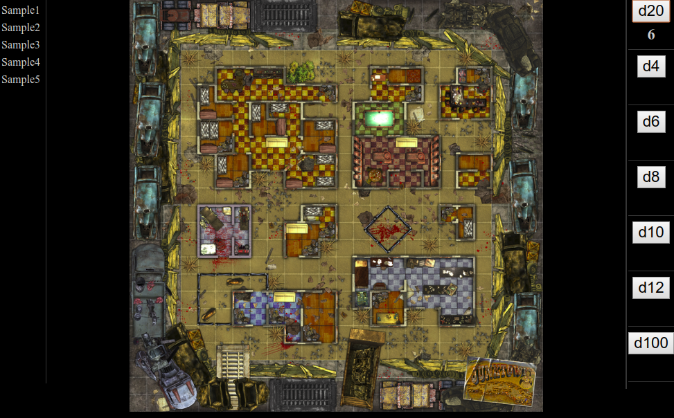

# DnD-Tile-Browser

While playing D&D adventures we wanted a way to have tilesets open in a browser tab, and avoid seeing the spoiler-y thumbnails. We also like to open our PDFs in the brower too, switch to full screen then we only need to switch between (fullscreened) browser tabs for a distraction free gaming experience. Can be used for any set of images you want to browse, not specific to D&D.

Click the tile image name and it brings the image up. Handy dice-roller buttons on the side.

## Instructions:

- Download or copy the play.html file found in the src directory into your folder of tile images.
- Edit the file and replace the placeholder list of images with the real ones.
- You must include the file extension.
- The last one in the list must NOT have a trailing comma.
- Save the file.
- Right-click the file and open in a web browser.
- Click the tile names to view them.
- You can use the dice rollers on the side (not visible on narro phones).

## Tips

- Use full-screen mode in your browser (usually F11) .Switch tabs easily via keyboard (usually Ctrl+Tab).
- A source of free tilesets: http://rpgmapshare.com/.

## Credits:

* Author: Sherri Wheeler
* Originally Created For: DnD 5E Solo Gamebooks by Paul Bimler
* Sample tiles found: http://rpgmapshare.com/ by Steel Rat
